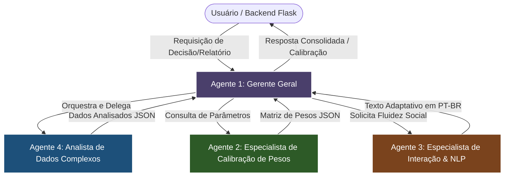

# 📝 Plano de Fase — Fase 6.1: Sistema de Agente de IA Local de Background (Multi-Agent Cascade)

## 🎯 Objetivo
Implementar um microssistema de agentes de IA local rodando em background (fora da visão direta do usuário), especializado e blindado em fluxo de malha fechada (*Closed-Loop*). O sistema usará uma LLM local leve altamente focada em raciocínio analítico (ex: Llama-3-8B-Lexi ou Phi-3-Medium via Ollama/Llama.cpp local) estruturado em quatro papéis bem delimitados, garantindo que os especialistas NUNCA interajam ou respondam diretamente ao usuário, reportando-se de maneira restrita e blindada ao **Gerente Geral**, que orquestrará a ação final de forma cirúrgica.

---

## 👥 Arquitetura e Papéis do Sistema Multi-Agente

### 1. **Agente 1: Gerente Geral (General Manager)**
- **Meta:** Administrar a execução das tarefas, avaliar criticamente as respostas dos especialistas e formular a resposta mais assertiva e unificada ao usuário/sistema.
- **Blindagem:** É o único que consome as entradas externas e entrega a saída unificada. Mantém a visão macro de negócios.

### 2. **Agente 2: Especialista em Calibração de Pesos (Calibration Specialist)**
- **Meta:** Trabalho puramente cirúrgico e matemático. Avalia discrepâncias em scores de confiança (ex: previsões da ST-GCN/Sentinela) e calcula ajustes finos nos pesos de composição do índice de risco regional.
- **Blindagem:** NUNCA lê o perfil humano direto nem responde em linguagem natural; opera sobre dados frios e devolve matrizes JSON cirúrgicas de pesos.

### 3. **Agente 3: Especialista em Interação do Usuário (Interaction Specialist)**
- **Meta:** Garantir que a comunicação do relatório consolidado e os feedbacks operacionais sejam apresentados em português fluido, adaptativo e empático.
- **Blindagem:** Não toma decisões matemáticas de calibração; apenas "traduz" e embeleza a inteligência analítica em português sob demanda restrita do Gerente Geral.

### 4. **Agente 4: Especialista em Análise de Dados Complexos (Complex Data Analyst)**
- **Meta:** Raciocínio puramente dedutivo sobre a consistência temporal das anomalias no ranking regional (CVLIs, correlação de facções e exógenos).
- **Blindagem:** Identifica padrões de degradação e anomalias do modelo sem saber como formular uma comunicação amigável.

---

## 🛠️ Tarefas de Implementação

### 1. **[T-1] Configuração do Serviço LLM Local (`src/agent/local_llm_client.py`)**
- Criar cliente leve otimizado para chamada via API HTTP local (Ollama rodando `llama3:8b` ou `phi3`).
- Implementar mecanismos de retry automático, timeout resiliente e parsing JSON nativo robusto.

### 2. **[T-2] Desenvolvimento das Classes de Agentes (`src/agent/multi_agent_system.py`)**
- Criar a classe base `BaseAgent` parametrizada com System Prompts hiper-focados.
- Implementar os 4 agentes com suas diretrizes cirúrgicas de blindagem.
- Blindar a comunicação: as classes dos especialistas não podem ser expostas fora do módulo. Apenas a classe `OrchestrationManager` (Gerente Geral) expõe uma interface pública.

### 3. **[T-3] Integração com as Rotas do Backend Flask (`app.py`)**
- Criar o endpoint de background `/api/agent/calibrate-report` que aceita os resultados brutos da ST-GCN e o histórico do usuário.
- Rodar a calibração assincronamente através de um Worker de background em Thread isolada para não afetar o desempenho visual do Report Preview.

### 4. **[T-4] Criação do Conjunto de Testes e Validação (`tests/test_multi_agent_system.py`)**
- Escrever testes automatizados simulando logs de esqueleto e perfis de usuário de Fortaleza/RMF.
- Validar se a comunicação dos especialistas permaneceu estritamente interna e se o JSON gerado pelo calibrador é matematicamente consistente.

---

## ✅ Critérios de Aceitação (UAT)
- [ ] O cliente LLM local conecta e faz inferências em menos de 3.5 segundos em hardware comum (GPU integrada ou CPU com quantização).
- [ ] O módulo de agentes exporta *única e exclusivamente* o Gerente Geral como ponto de contato.
- [ ] O Especialista em Calibração retorna saídas JSON válidas com floats de pesos calibrados (ex: `weights: {posture: 0.85}`).
- [ ] O Especialista em Interação gera textos perfeitamente inteligíveis em português fluente e adaptado.
- [ ] O pipeline roda de forma assíncrona sem travar os endpoints HTTP de visualização do dashboard.
- [ ] Todos os testes unitários em `tests/` executam com sucesso.

---

## 🚨 Riscos e Mitigações
- **Risco:** Latência excessiva da LLM local rodando em CPU sem aceleração por hardware dedicada.
- **Mitigação:** Utilizar quantizações ultra-leves (GGUF Q4_K_M) do Phi-3 (3.8B) ou Llama-3-8B-Lexi, que operam com alta velocidade e baixo consumo de RAM (menos de 4.8GB).
- **Risco:** Alucinação de formato JSON quebrando o processamento do backend.
- **Mitigação:** Adicionar um parser robusto de fallback determinístico com regex que corrige as chaves JSON inválidas de forma transparente no Gerente Geral.
