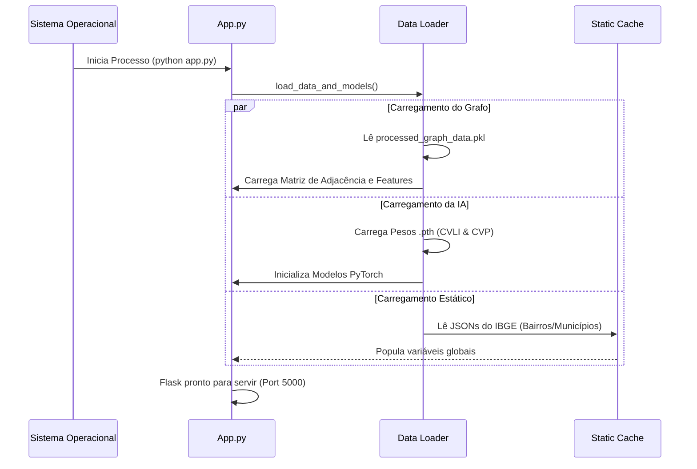
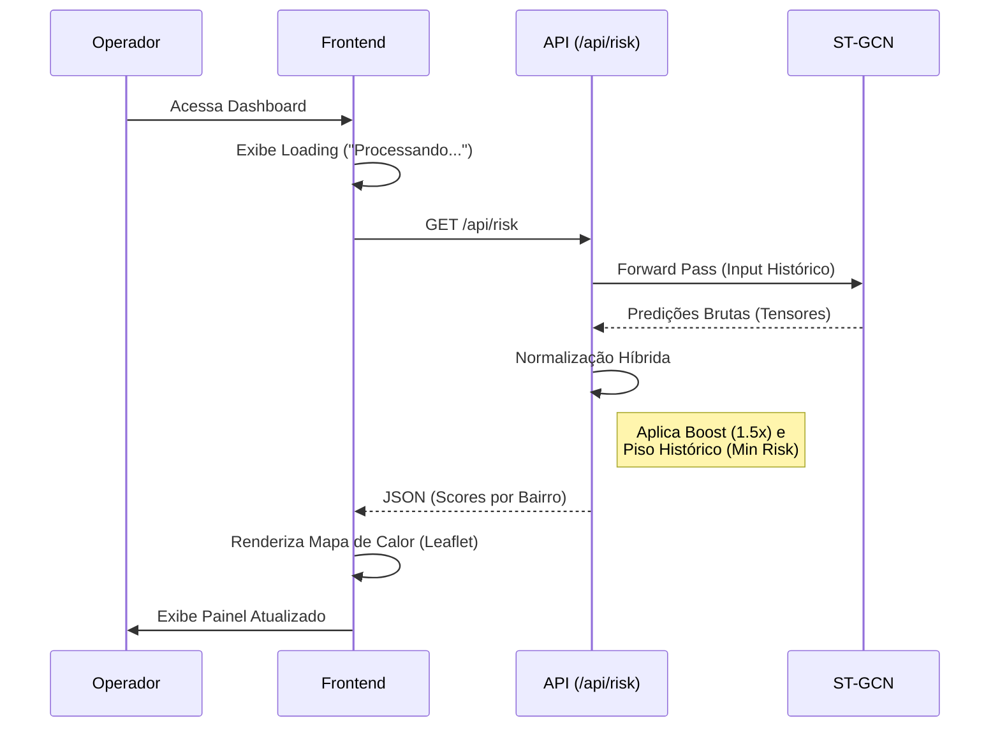
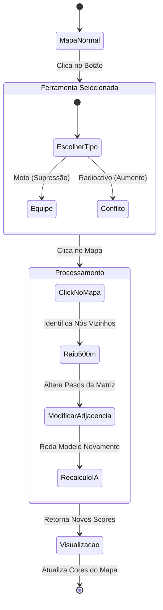

# Arquitetura do Sistema e Fluxos de Funcionalidade

Este documento detalha a estrutura técnica e os fluxos de operação do Sistema de Inteligência Preditiva de Segurança Pública.

## 1. Arquitetura de Alto Nível

O sistema opera em uma arquitetura monolítica modularizada, onde o backend (Python/Flask) serve tanto a API quanto os arquivos estáticos do frontend. O núcleo de inteligência é uma rede neural baseada em grafos (ST-GCN).

```mermaid
graph TD
    subgraph "Camada de Dados (Data Layer)"
        RawData[CSV Ocorrências & GeoJSON Polígonos]
        StaticData[JSON Bairros & Municípios IBGE]
        ProcessedData[Pickle: Grafo Processado]
    end

    subgraph "Backend (Python)"
        DataProc[Data Processor (Pandas/GeoPandas)]
        STGCN[Modelo IA: ST-GCN (PyTorch)]
        Flask[Servidor Flask (API)]
        GeoLoc[Motor de Geolocalização]
    end

    subgraph "Frontend (Web)"
        Map[Leaflet.js Map]
        UI[Bootstrap 5 Interface]
        ClientLogic[jQuery / AJAX]
    end

    RawData --> DataProc
    DataProc --> ProcessedData
    ProcessedData --> Flask
    StaticData --> GeoLoc
    STGCN --> Flask
    Flask <-->|JSON| ClientLogic
    ClientLogic --> UI
    ClientLogic --> Map
```

---

## 2. Componentes e Tecnologias

| Componente | Tecnologia | Função |
| :--- | :--- | :--- |
| **Modelagem de Grafo** | `NetworkX` / `Numpy` | Transforma a cidade em nós (bairros) e arestas (vizinhança) para análise matemática. |
| **Inteligência Artificial** | `PyTorch (ST-GCN)` | Rede Neural Convolucional em Grafos Espaço-Temporais. Aprende padrões de crime no tempo e espaço. |
| **Geoprocessamento** | `GeoPandas` / `Shapely` | Manipulação de polígonos, cálculo de centróides e distâncias. |
| **API Server** | `Flask` | Expõe os endpoints `/api/risk`, `/api/simulate` e `/api/exogenous`. |
| **Frontend** | `HTML5` / `JS` / `Leaflet` | Interface tática para o operador. Renderiza o mapa de calor e controles. |

---

## 3. Fluxos de Funcionalidade (Visual Flows)

### 3.1. Inicialização do Sistema
Como o sistema carrega e prepara os dados ao iniciar.



### 3.2. Análise de Risco Padrão
O fluxo principal quando o usuário acessa o dashboard.



### 3.3. Ingestão de Dados Exógenos (Novo Recurso)
O fluxo complexo de interpretar texto livre e atualizar o mapa.

```mermaid
flowchart TD
    A[Operador cola texto da CIOPS] -->|Submit| B(Frontend envia p/ /api/exogenous/parse)
    B --> C{Parser Regex}
    C -->|Extrai| D[Lista de Eventos: Natureza + Local]

    subgraph "Motor de Geolocalização (4 Camadas)"
    D --> E{Busca Nó exato no Grafo?}
    E -- Sim --> F[Coordenada do Nó]
    E -- Não --> G{Busca Bairro IBGE?}
    G -- Sim --> F
    G -- Não --> H{Busca Município Ceará?}
    H -- Sim --> F
    H -- Não --> I{Busca Palavra-chave Cidade?}
    I -- Sim --> F
    I -- Não --> J[Descartar Evento]
    end

    F --> K[Lista de Pontos Confirmados]
    K --> L(Frontend recebe Pontos)
    L --> M[Plota Marcadores no Mapa]
    M --> N(Frontend chama /api/simulate)

    subgraph "Simulação de Risco"
    N --> O[Backend cria Cópia do Grafo]
    O --> P[Aumenta Pesos nos Locais dos Eventos]
    P --> Q[Recalcula Risco (ST-GCN)]
    end

    Q --> R[Mapa Atualizado com Criticidade Elevada]
```

### 3.4. Simulação de Cenários (Supressão/Conflito)
Como o usuário interage com as ferramentas de simulação manual.


