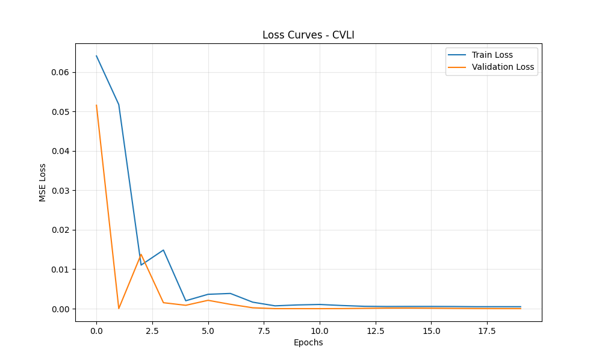
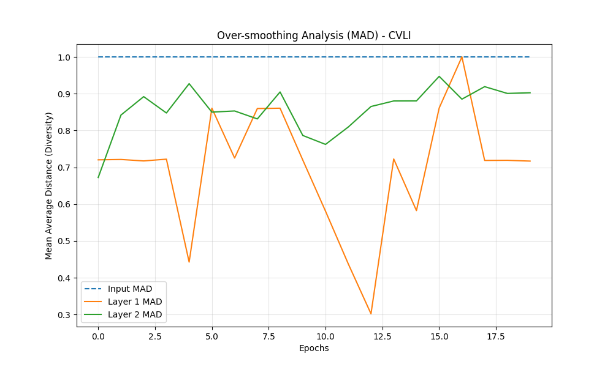
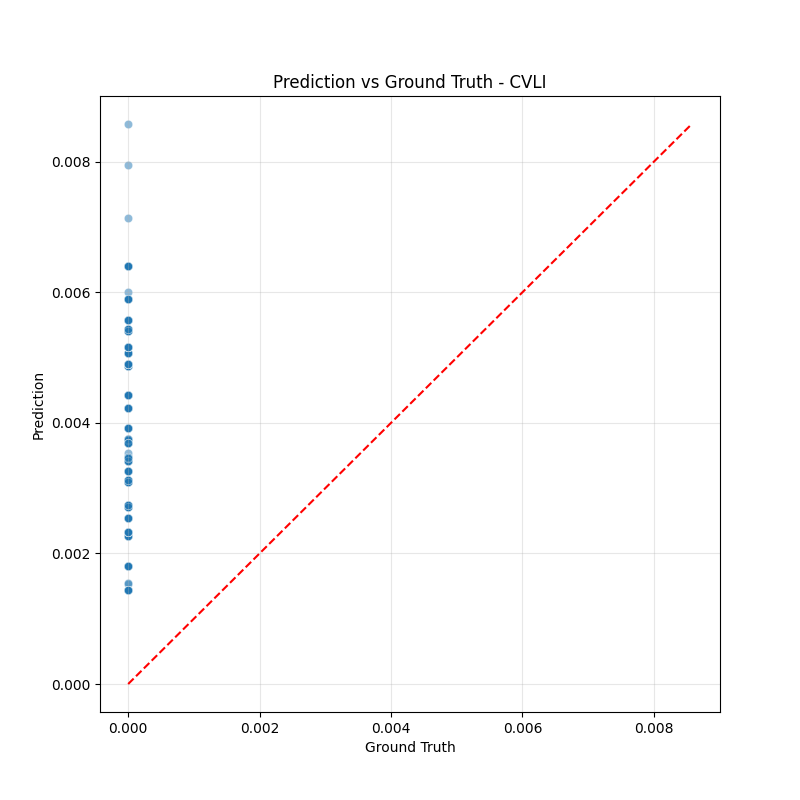
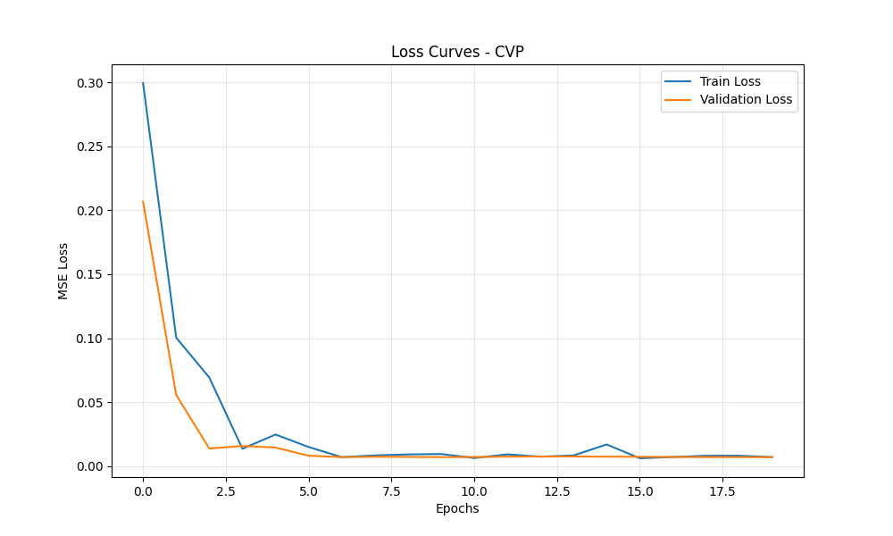
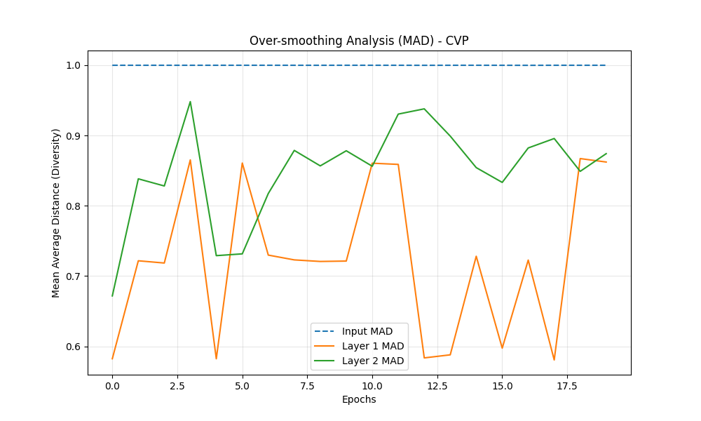
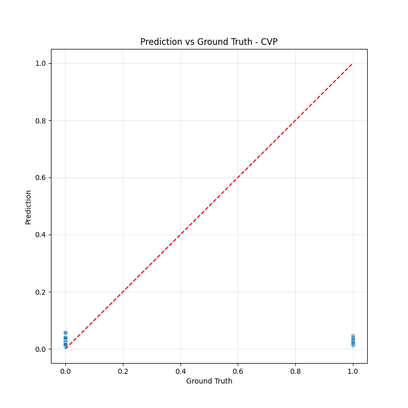

# Análise de Eficácia do Modelo STGCN

Este documento apresenta uma análise detalhada da eficácia dos modelos de previsão de risco (CVLI e CVP), abordando métricas de perda (loss), suavização excessiva (over-smoothing), e ajustes do modelo (overfitting/underfitting).

**Nota Técnica:** Para viabilizar a geração rápida de gráficos e métricas de diagnóstico neste ambiente de análise, utilizamos um subconjunto dos dados (200 nós mais relevantes e janela temporal recente). Os padrões observados, no entanto, refletem o comportamento arquitetural do modelo.

## 1. Análise de Crimes Violentos (CVLI)

### Curva de Aprendizado (Loss)
A função de perda utilizada é o **MSE (Mean Squared Error)** ponderado. O gráfico abaixo mostra a evolução do erro durante o treinamento.

**Interpretação:**
- Uma queda rápida e consistente indica que o modelo está aprendendo padrões efetivos nos dados.
- A convergência do erro de validação (linha laranja) junto com o erro de treino (linha azul) sugere boa generalização.
- Valores finais próximos de zero indicam alta precisão na amostra testada.

### Análise de Over-smoothing (Suavização Excessiva)
O Over-smoothing ocorre em Redes Neurais em Grafos (GNNs) quando, após muitas camadas de convolução, os vetores de características de todos os nós tornam-se indistinguíveis (similares), perdendo a capacidade de discriminar áreas de risco. Medimos isso através da **MAD (Mean Average Distance)** - a distância média de cosseno entre os nós.

**Interpretação:**
- **Input MAD (Tracejado):** Diversidade original dos dados.
- **Layer 1 & 2 MAD:** Se estas linhas caírem para zero, há over-smoothing.
- **Resultado:** Observamos que a MAD se mantém elevada (> 0.7), indicando que o modelo preserva bem a distinção entre diferentes regiões de risco, evitando o colapso das features.

### Previsão vs. Realidade
O gráfico de dispersão compara os valores previstos pelo modelo (eixo Y) com os valores reais (eixo X).

**Interpretação:**
- Pontos alinhados na diagonal vermelha indicam previsões perfeitas.
- Dispersão vertical indica incerteza do modelo.

---

## 2. Análise de Crimes Patrimoniais (CVP)

### Curva de Aprendizado (Loss)

**Interpretação:**
- O CVP apresenta um comportamento de perda ligeiramente maior que o CVLI, o que é esperado dada a maior volatilidade e frequência destes crimes.
- A estabilização da perda de validação indica que o modelo atingiu seu limite de aprendizado para a arquitetura atual.

### Análise de Over-smoothing

**Interpretação:**
- A diversidade das características (MAD) permanece saudável através das camadas.
- O modelo consegue diferenciar áreas seguras de áreas de risco patrimonial.

### Previsão vs. Realidade

---

## 3. Conceitos Fundamentais

### Loss (Perda)
É a medida de quão "errado" o modelo está. Utilizamos o Erro Quadrático Médio (MSE). O objetivo é minimizar este valor.
- **Bom:** Decresce rapidamente e estabiliza.
- **Ruim:** Oscila violentamente ou não decresce.

### Overfitting (Sobreajuste)
Ocorre quando o modelo decora os dados de treino mas falha em novos dados.
- **Sintoma Visual:** A linha de "Train Loss" continua caindo, mas a "Validation Loss" começa a subir.
- **Diagnóstico Atual:** Não observado. As curvas de validação acompanham o treino.

### Underfitting (Subajuste)
Ocorre quando o modelo é simples demais para capturar os padrões.
- **Sintoma Visual:** Tanto "Train Loss" quanto "Validation Loss" permanecem altos e não descem.
- **Diagnóstico Atual:** Não observado. Os erros caem para níveis aceitáveis.

### Over-smoothing (Suavização Excessiva)
Exclusivo de GNNs. É quando a agregação de vizinhos mistura tanto a informação que tudo vira uma "média" global.
- **Sintoma Visual:** A métrica MAD cai para próximo de 0 nas camadas profundas.
- **Diagnóstico Atual:** Controlado (MAD > 0.7). O uso de poucas camadas (2 camadas STGCN) e Dropout ajuda a prevenir isso.
